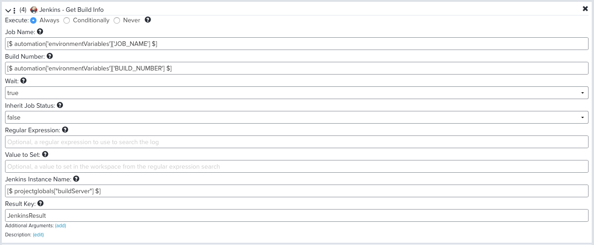

Advanced/Alternative Jenkins Configuration Scenarios
====================================================

In the main cookbook story presented in this guide, we allowed Continuum to
completely orchestrate our Value Stream, which means that it triggered our
Jenkins build job after a commit occurs.  There are at least two scenarios
where this might not work for you:

1. Jenkins server is located on a private LAN that the Continuum server is not
   able to communicate with.

2. You cannot or do not want to run a Jenkins build for every commit. One of our
   applications has a complicated CI process that runs thousands of integration
   tests that requires spinning up a dozen Jenkins workers and runs of well over
   an hour. On account of this, we cannot run this process on every commit as we
   have people committing constantly throughout the day. So we use Jenkins SCM
   polling so that Jenkins only runs at most every 2 hours.
   
Fortunately, both of these scenarios can be solved using the same technique with
only a slight variation. I will describe the process here.

Project Configuration
---------------------
If you recall, when we configured our project earlier, we added **Directives**
which controlled what Continuum does upon receiving a source code submission.
There was a directive called Package Into Phase that we used to create a package
and initialize it in the the Building phase.  This in turn kicks off a pipeline
which triggers a build of that commit.

In these scenarios, we cannot do that.  Instead, we will use a different
directive named **Assign to Pipeline**.  What this directive will do is tell
Continuum to create a "bucket" where it stores the submissions that are coming
in and associate them all with a pipeline job that is specified in the
directive.

I will walk through the configuration of this pipeline shortly, but it works
similar to the one we created for building our application before, except we
will not use the Jenkins Build directive in the pipeline, and will instead use
some directives to create the package and put it into the first phase.

In our Jenkins job configuration, we will use a Continuum plugin to call API
in Continuum to run the pipeline when the Jenkins build job runs.  In other
words, the Jenkins build job will run based on its SCM polling, and when the
job starts to run, it will then tell Continuum to run the pipeline.  This will
cause Continuum to take all of the commits it has stored in the bucket and link
them all to that instance of the pipeline run.  So essentially we are just
reversing the flow in which things work.

Let's explore this in more detail.

Project Configuration
---------------------
As noted in the Overview, we will add a different directive to our Project
configuration called Assign to Pipeline.  That looks like this:

We use the same When condition we used before to limit this directive to commits
going to master or a release branch.  We then just need to specify the pipeline
we want to assign this to (which we have not created yet) and the group and
project. The group should be the branch name, and when the previously mentioned
bug is fixed you could specify a value of `[$ branch $]` here for that, but
until then we are going to extract the branch name from the ref.

    [$ ref.replace('refs/heads/', '') $]

Finally, you also need to specify the Project name. These three values combine
to form your bucket, which the submissions will be stored together in until the
pipeline runs.

Pipeline Configuration
----------------------
Next we need to create the pipeline definition. This is where we will specify
what we want to do when the automation runs.  We are going to do six steps:

1. Create a new package revision.  Continuum will automatically link all of the
   queued commits with this revision of the package when we do this.
2. "Promote" the package revision to the first phase of our progression. This is
   so that we can see the build running on our progression board.
3. Wait. We will add a directive that causes the pipeline to wait until a
   specific data element appears in the workspace.  This will be set from the
   Jenkins job via an API call when the job ends. This will let Continuum know
   the build finished and it can continue the pipeline.
4. Get Build Info. This step will be optional based on whether or not Continuum
   can communicate with your Jenkins server, but if it can this will allow
   Continuum to pull back the Jenkins job information into the pipeline just as
   it does when it initiates the job.
5. Create artifact. This is just the same step we did in the original job.
6. Set control. This is just the same step we did in the original job and it
   controls whether or not the package is promoted to the next phase.

If you recall the two scenarios at the beginning of this page, they can both be
handled by this technique with some minor adjustments.

* If you are doing this because Continuum cannot talk to Jenkins then you cannot
  do step 4. You would also make some small changes to step 5 and 6 to get the
  Jenkins job status from the data in the workspace created by step 3.

* If you are doing this because you just need Jenkins to initiate your builds
  then you could follow these exact steps. However, you could also eliminate
  step 3 and just use the "wait" option built in to step 4. This would mean
  that Continuum will poll your Jenkins server every 20 seconds to determine
  when your build ends. In my scenario, since the build lasts for hours, it
  seemed more reliable to NOT poll the Jenkins server for such a long period
  of time.

Let me show these pipeline actions in more detail.

Create Package Revision
-----------------------
The first action is to create a new package revision.

The first parameter is the *Package Name*. Here are I am using the same
technique as before where there would be a project global variable to specify
the name of the package to create. You could of course also just type in a name.

    [$ projectglobals["packageName"] $]

The next two parameters are the version of the package and the full version. For
example "1.0" and "1.0.123". The values we are using in this example are coming
to the pipeline from Jenkins. When Jenkins initiates this pipeline it is also
going to set data into a workspace variabled named "automation" and in that
variable is another variable named "environmantVariables" and this will contain
all of the environment variables from the Jenkins job.  In this example, the
Jenkins job contains an environment variabled named PIPELINE_VERSION that
contains a value like "1.0". It then also has access to the Jenkins build
number from an environment variable and that is used in the full version.

    [$ automation['environmentVariables']['PIPELINE_VERSION'] $]
    [$ automation['environmentVariables']['PIPELINE_VERSION'] $].[$ automation['environmentVariables']['BUILD_NUMBER'] $]

The final parameter to use is the Result key. This will cause the workspace to
add a new data element that stores information about the package we created.
This will be needed on later steps. I named this `PackageResult`

Promote Package Revision
------------------------
The next action will put our package revision on our progression board.

Parameters are similar to previous step except it uses the PackageResult
workspace key to pick up the revision number of the package created in the
previous step.

    [$ PackageResult['revision'] $]

Wait for Data
-------------
The first two steps will happen very quickly. Presumably, Jenkins will
initiate this pipeline at the very beginning of its job run, so now we want
Continuum to wait until the job ends so that it knows whether it worked or not.
We are going to use a directive that causes Continuum to wait for a certain
data element to appear in the workspace of the pipeline. We will add this
data element at the end of our Jenkins job.

With this directive you just tell Continuum what to wait for and how long to
wait.  We use the following expression:

    "returns" in __WORKSPACE

Jenkins is going to use the post\_pi\_data REST API to add a key/value to the
workspace. This API add that key/value to an key named "returns" that it adds.
So we will just watch for the appearence of that key.

We then tell it to wait for 4 hours and to fail if it does not appear. The 4
hours is just an arbitrary choice here, choose a value that makes sense for you.

Get Build Info from Jenkins
---------------------------
The next step is identical to the Build action we used in the original pipeline
except this step does not trigger a build, it just reads a build.  This step
needs to know the build job name and number to retrieve which it gets from
the data that Jenkins stored in the workspace when it initiated this pipeline.

As noted earlier, since this action can wait for the job to end, you could
eliminate the previous action. In my case, I did not want to poll the Jenkins
server for hours. This step is not going to run until the job has ended so it
will not need to wait.

If you can use this action, the nice thing about it is that it will pull back
your job information and store it in the pipeline.  So you still have access
to things like how many tests ran as well as the log from the job.

Create Artifact
---------------
This step is identical to the one we did when setting up the original pipeline
so refer to that page for details. In this example, we are building the
version number a bit differently, so just account for that and do it the same
way we did for the package.

Also, if you want to condition this step on the Jenkins job result but you
are not able to execute the Get Build Info action, then you can instead look
at the data that is set from the Jenkins job in the wait for data step.  That
condition would be something like this:

    returns['status'] == "pass"

Set Control Data
----------------
This would be configured similar to what we did in the original pipeline. As
with the previous step if you need to configure this based on the data set
from Jenkins via API the condition would be:

    [$ returns['status'] $]

This is because the Jenkins job sets a key named "status" with a value of "pass"
or "fail"

Jenkins Job Configuration
-------------------------
The final step is we need to configure Jenkins to initiate the pipeline and
set the pass/fail status of the job. The first thing you will need to do is
install the Continuum plugin on your Jenkins server. This is only needed for
this scenario where you want to be able to execute Continuum API from your
Jenkins pipeline scripts. You can find the plugin in the list of available
Jenkins plugins as well as here:
https://wiki.jenkins.io/display/JENKINS/Continuum+Plugin

Once installed, there are new Continuum directives available to use in your
Jenkins pipeline scripts.

It is important that you initiate the Continuum pipeline as soon as your Jenkins
job begins to run. This is because your Jenkins job is fetching the latest
commits when it begins to run, and Continuum should know about the same commits.
But if you wait until the Jenkins job has been running for a while it is
possible that Continuum now knows about even more commits that were not
included in this build and we do not want Continuum to associate those commits
with this run.

So ideally you should have something like this at the very beginning of your
Jenkinsfile script:

    stage('Continuum') {
        steps {
             ctmInitiatePipeline serverUrl: 'https://devops.example.com', credentialsId: 'Continuum', project: 'Example', group: 'master', definition: 'Jenkins Initiated Build', environmentVariables: '*'
        }
    }

The first parameter is the URL of your Continuum server.

The next parameter is a credentials ID within Jenkins. This allows you to
securely store your Continuum API token inside Jenkins.  Just create a 
username/password credential in Continuum.  The username can be any value you
want, and the password should be your API token from Continuum.  You also give
the credential an "ID" and that is what you refer to in the above directive.

The next parameter are the Continuum project name, group and pipeline
definition. Remember the group should correspond to your git branch name. I
have used strings here but you could get these from job parameters too.

The next thing you want to do is add an API call to the end of the pipeline
that communicates the job status back to the pipeline.  This will also trigger
the pipeline to resume running if it is waiting for this data.

    post {
        success {
            ctmPostPiData serverUrl: 'https://devops.example.com', credentialsId: 'Continuum', key: 'status', value: 'pass'
        }
        failure {
            ctmPostPiData serverUrl: 'https://devops.example.com', credentialsId: 'Continuum', key: 'status', value: 'fail'
        }
    }

This will always run at end of the job and send the pass or fail status back to
the pipeline workspace so that it can condition the actions accordingly.

Links
-----

* Related Topic: [Pipelines](PIPELINES.md "Pipelines")
* Related Topic: [Projects](PROJECTS.md "Projects")
* Return to: [Overview](../README.md "Overview")

