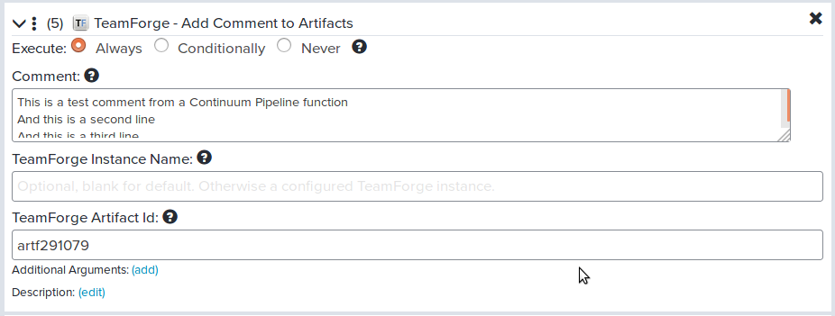

Advanced Pipeline Steps for TeamForge
====================================================

In the main cookbook story presented in this guide, we defined a very simple 
pipeline in Continuum which triggered a Jenkins build, created Continuum artifact
and updated a few properties for the package within Continuum. 

If you are running Continuum 18.0 or later, several plug-in functions for TeamForge 
will allow you to address additional, more complex, scenarios:

1. Update TeamForge artifacts associated with the pipeline instance, to add a comment or set an artifact field value to the version of the package being built by the pipeline. 
2. Transition TeamForge artifacts, associated with the pipeline instance, to a new state. This could be used to indicate the readiness for testing or delivery.
3. Once the package is delivered, pipeline could create a source code branch for future support cases or hotfixes to a particular release. 
3. Create a source code tag, for the version of the package being built.
4. Delete a source code branch, once the feature branch has been successfully tested and merged into the master.

If you plan to use the functions described below, make sure that the account you used to configure the TeamForge plugin has the necessary permissions to execute the relevant artifact- or git-related APIs.

Update Artifact
---------------
Go to the left-hand side and click on **TeamForge**.  Then drag the action
named ***Update Artifact*** over to the Stage and drop it. It will look like this:

The first parameter of the function, *TeamForge Instance Name*. This is referencing the
TeamForge plugin we setup at the beginning of the guide.  This lets you specify
the name (or key) you used to identify the TeamForge server.  If you only have one server
you can leave this value empty or you could also key in the Name you specified.

Next parameter, *TeamForge Artifact Id*, is optional. This could be the value of a specific artifact. 
However, it is probably more common to leave this parameter empty. When no artifact id is specific, 
all workitems (TeamForge artifacts) associated with the pipeline instance will be updated. 

When *TeamForge Artifact Id* is left empty, the next field, *Folder Type* could be used to apply 
the changes only to workitems (TeamForge artifacts) of a certain type, from a specific TeamForge 
tracker. For example, type in *Stories* into this field to update only Stories workitems. When no
folder type is specified, all workitems (TeamForge artifacts) associated with the pipeline instance will be updated.

The next two fields, *Field Name* and *Field Value*, should contain the name of the field to update,
and the new value to place in that field. 

Finally, the optional *Result Key*  allows you to store information about the changes made in the
workspace, using the key name that you specify here. After execution, the list of changed artifacts, 
the field name along with the old and new values of the field, will be placed into the workspace 
under the specified key. The dotted notation is supported for this field (e.g. "parent.child.grandchild") .
The output will looks something like this:

The field\_name and new\_value reflect the settings of the plugin function. The updated\_count will be set to the number of artifacts 
actually updated, and updated\_artifacts is the array of artifact IDs that were updated. The previous\_value field will be set to the previous value contained within the field, before the changes.

Change Artifact Status
----------------------
Go to the left-hand side and click on **TeamForge**.  Then drag the action
named ***Change Artifact Status*** over to the Stage and drop it. It will look like this:

The first three fields and the last field are the same as in the ***Update Artifact*** function:
-  The optional *TeamForge Instance Name* field can be used to identify the specific TeamForge server
-  The optional *TeamForge Artifact Id* field can be used to update status of a specific artifact, when not specified all workitem (TeamForge artifacts) associated with pipeline are updated.
-  The optional *Folder Type* field can be used to filter workitems associated with the pipeline, and change only that belong to a particular TeamForge tracker.
-  The optional *Result Key* field allows you to store information about the workitems (TeamForge artifacts) changed.

The *New Status* field is required, and should contain the display name of the desired new status for the work item.

Add Comment to Artifact
-----------------------

To add comments to a TeamForge artifact, go to the left-hand side and click on **TeamForge**.  Then drag the action
named ***Add Comment to Artifact*** over to the Stage and drop it. It will look like this:

Just like in ***Change Artifact Status*** and ***Update Artifact***, the optional *TeamForge Instance Name* and *TeamForge Artifact Id* fields 
can be used to indicate specific TeamForge server or TeamForge artifact. When left empty, all workitems (TeamForge artifacts) associated with the
pipeline will be changed.

Get Artifact
------------
The ***Get Artifact*** function can be used to retrieve details about a particular artifact, and placed into the *Workspace* for use in the next steps of the pipelines. 

Just like in other functions, the *TeamForge Instance Name* and the *Result Key* parameters are optional. 

Unlike in other functions, though, the *TeamForge Artifact Id* is required. Only single artifact properties can be retrieved by this function.

Upon execution, the properties of the TeamForge artifact placed into the workspace will look something like this:

Note that all fields returned by the TeamForge REST API are added to the workspace. Several of the raw ID fields (such as folderId and planningForlderId) are additionally looked up, and their display names are added to the output as well (folderTitle and planningFolderTitle). 

Create Git Branch
-------------
The next few plugin functions allow the pipeline to take actions within TeamForge SCM (GIT).

To create a new branch for a GIT repository, go to the left-hand side and click on **TeamForge**.  Then drag the action
named ***Create Git Branch*** over to the Stage and drop it. It will look like this:

Just like in other functions, the *TeamForge Instance Name* is optional, and can be used to specify the name of a particular TeamForge server against which the action should be executed.

The *TeamForge GIT Repo ID* field is a required field, which should specify the repository to be branched. This field's value should be in the format of *repsNNNN*.

The *Source Revision* field is another required field that specifies the revision on which the branch should be based. For example, "master" could be specified to branch the head revision on the master branch as the branching point.

Specify the name for the new branch name in the required *Branch* field.

Delete Git Branch
-------------
To delete an existing branch from a GIT repository, go to the left-hand side and click on **TeamForge**.  Then drag the action
named ***Delete Git Branch*** over to the Stage and drop it. It will look like this:

Just like in other functions, the *TeamForge Instance Name* is optional, and can be used to specify the name of a particular TeamForge server against which the action should be executed.

The *TeamForge GIT Repo ID* field is a required field, which should specify the repository to be branched. This field's value should be in the format of *repsNNNN*.

Specify the name of the branch to delete in the required *Branch* field.

Create Git Tag
--------------
To create a new tag, based on a particular revision in a repository, go to the left-hand side and click on **TeamForge**.  Then drag the action
named ***Create Git Tag*** over to the Stage and drop it. It will look like this:

The first three parameters, *TeamForge Instance ID*, *TeamForge Git Repo ID* and *Source Revision* are the same as for ***Create Git Branch***.

The *Message* and the *Notes* parameters are optional, and can be used for annotating the newly created tag.

List Repositories
-----------------

To list all repositories for a TeamForge project, use ***List Repositories*** function under **TeamForge** plugin. It will look something like this:

The *TeamForge Instance Name* optional parameter lets you specify
the name (or key) you used to identify the TeamForge server.  If you only have one server
you can leave this value empty or you could also key in the Name you specified.

The *TeamForge Project Id* is required, and should specify the ID of the project for which the repositories should be listed.

Finally, the optional *Result Key*  allows you to store information about the changes made in the
workspace, using the key name that you specify here. After execution, the list of changed artifacts, 
the field name along with the old and new values of the field, will be placed into the workspace 
under the specified key. The dotted notation is supported for this field (e.g. "parent.child.grandchild").
The output will looks something like this:

Note that this list will contain both Git and SVN repositories for a project.