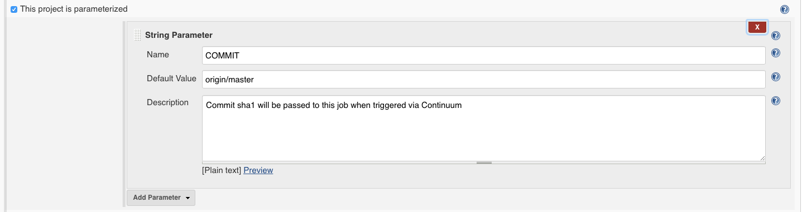
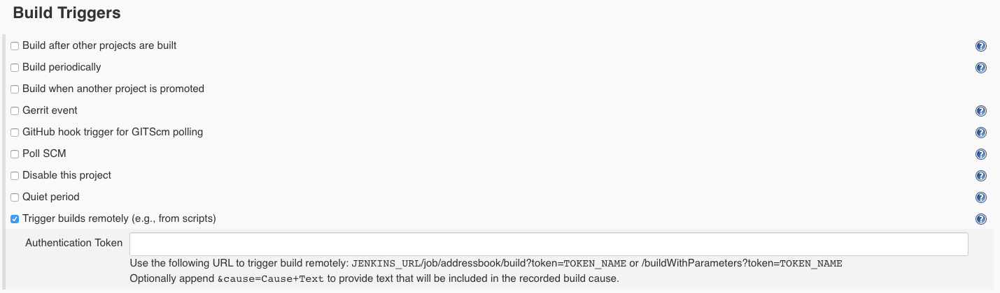
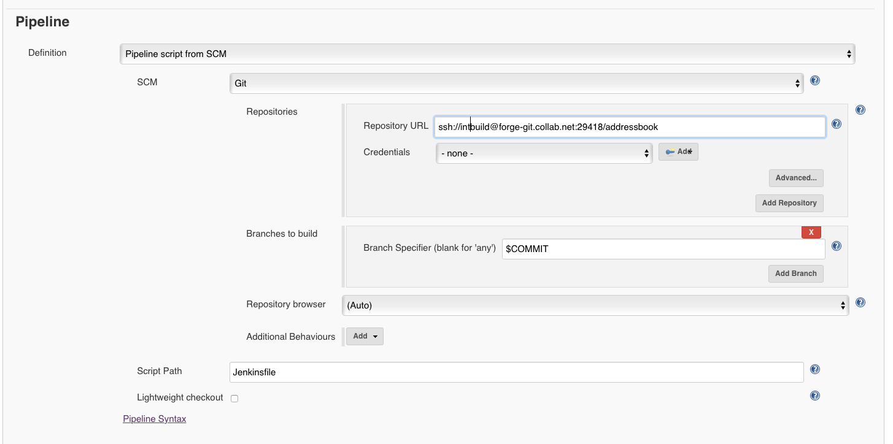

Configuring Jenkins
===================

When we configured our pipeline to trigger the Jenkins build, recall that we
configured Continuum to pass the commit sha1 to build via a parameter. We want
Jenkins to build the specific commit that Continuum asks it to build so now we
must change our Jenkins job configuration so that it checks out the sha1 it is
asked to check out and does not just always build the most recent commit.

Go to your Jenkins server, click on your job and click on Configure.  These
screenshots are from a Jenkins 2.x pipeline job. Some of the details may look
different on other Jenkins servers but the general concepts will apply to all
versions and types of jobs.

Define the Parameter
--------------------
The first thing we need to do is add the parameter to our job.  Near the top of
the job configuration is a checkbox that says the project is parameterized.
Click on that check box if necessary and then add a String parameter and fill
it out to look like this:

The name of the parameter must match what we configured in the Continuum
pipeline action. In the earlier example, the parameter name was COMMIT.  The
default value will only be relevant if you run this build job manually.

Define the Build Trigger
------------------------
Jenkins jobs have a section that indicate how they are triggered. Your job is
likely configured to "Poll SCM". We want to remove that option and change it to
"Trigger Build Remotely".  It should look like this:

Configure Git Plugin
--------------------
Your job presumably uses the Git plugin to checkout your code and this was
likely configured to checkout the HEAD of master.  We need to change it to
checkout the COMMIT parameter instead.  Do that by entering a value of $COMMIT
in the Branch specifier:

With these changes made and saved, your job is now ready to be triggered
remotely and to build the specific commit sha1 it is asked to build.

Links
-----

* Related Topic: [Pipelines](PIPELINES.md "Pipelines")
* Return to: [Overview](../README.md "Overview")

