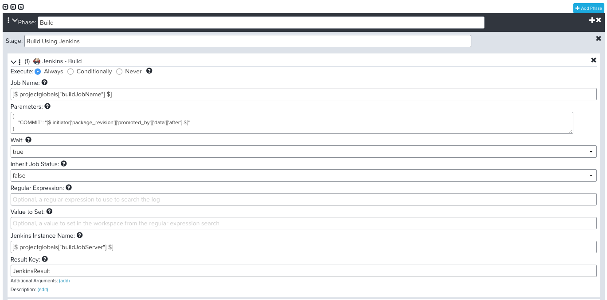
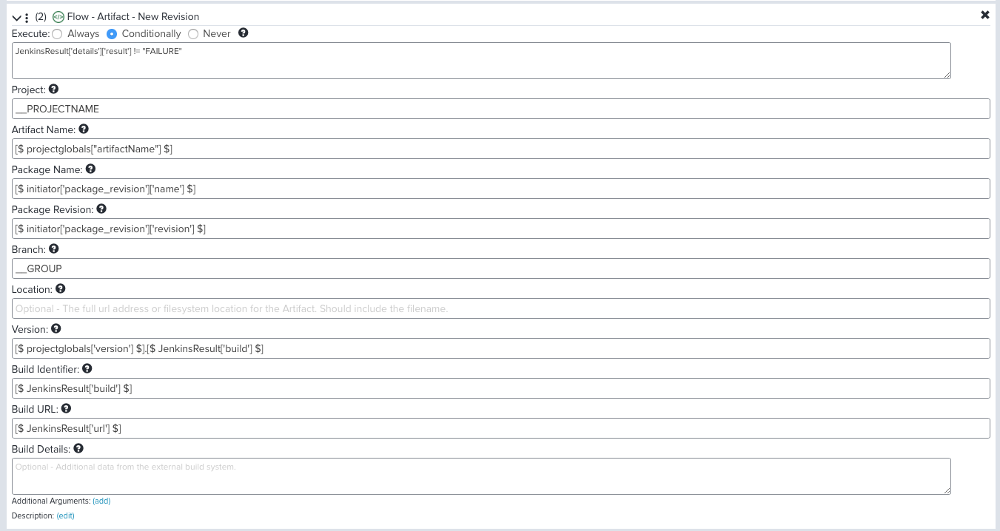
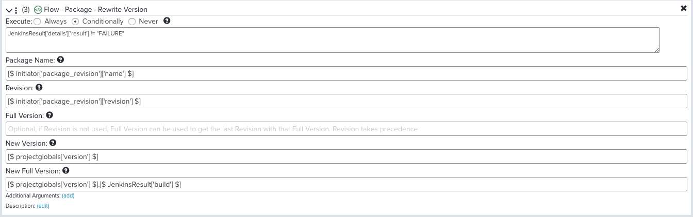
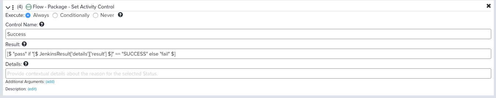
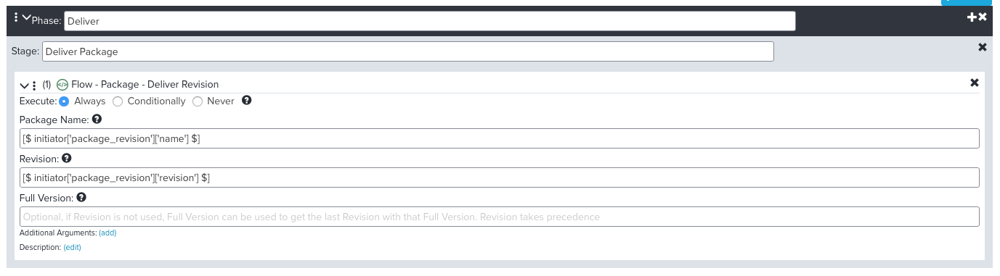

Pipelines
=========

Pipelines are what you use to write your automations of your activities, such
as running a build process or changing the status of a work item, but they are
also used to create and manipulate the objects in Continuum such as setting a
version number on a package based on a build result or promoting a package in
a progression.  Just because I wondered this when I was first learning, I will
say that you will likely have many pipelines.  When you think of your entire
DevOps process, it will likely not just be one big pipeline.  The pipelines
will be the automations you run at various points in your process.  For example,
your build process will be a pipeline.  If you want it to, maybe you will also
run some tests during this pipeline and perhaps if those pass you may even
install the build on a test server for manual testing.  But all of those things
could also be separate pipelines if it makes sense which would certainly be the
case if there are any manual handoffs that occur between these steps in your
process.

Pipelines are comprised of one or more synchronous **Phases** which in turn are
comprised of one or more asynchronous **Stages**. A given stage can have many
actions which are executed in sequence. As an example, you might have a Pipeline
with the phases of Build, Test and Deploy which would run in order only after
the previous phase completed successfully.  During the Test phase, perhaps you
have two stages for two different types of tests that you want to run in
parallel asynchronous to each other. In this guide, we are going to keep things
simple and run things in a serial order, but it is good to know that this
capability does exist for where it could be useful.

Another important concept to know is that when a Pipeline runs it has something
called a **Workspace** which is a set of JSON data with information about the
instance.  It contains data that might have been passed into the instance as
part of initiating it and it can also be used to store data as the pipeline
runs so you can pass along information from one step to the next.  The data in
the workspace is referenced using a syntax like this:

    [$ keyname[“subkeyname”] $]

When you view a pipeline instance, either while it is running or after it runs,
you can see the workspace data and explore the JSON structure.  This is useful
for getting an idea what data is available and what the key names are etc.

Pipelines are a big topic to learn. For now, we are just going to create a
simple pipeline definition that we will use to run a Jenkins job to build our
application. We will need to reference this definition in a later step we setup,
so we are going to put something in place now so that we do not have to jump
around.  We will return to pipelines later on as we flesh out the process more.

Create Your First Pipeline Definition
-------------------------------------
Go back to the Admin menu in the top right and choose Pipelines and then click
on Add New. In the pop-up dialog, you provide a name and description for your
pipeline. I am going to name this “*Common Build*” because it is a definition I
intend to use for several applications that will follow a similar process to be
built.  I am going to make use of variables so that the job is not hard-coded
to a particular build job or source code repository.

The Pipeline definition editor will open up. On the left-hand side is the list
of available plugins which contain the various steps you can insert into your
Pipeline.  Feel free to click on the plugins to get a sense of the rich
assortment of functionality available.  In this guide, we will be focusing on
just two of the plugins.  Jenkins, which has actions to trigger a job or fetch
info about a job and Flow which contains many actions for working with the
objects that make up Continuum.

On the right-hand side is where you create your definition. It will have been
initialized with a Phase and a Stage.  This is all we are going to need for
this definition.  You can give the Phase a name and the Stage a description,
but it is not necessary other than as documentation of what the pipeline does.
I am going to name my phase “*Build*” and the stage “*Build Using Jenkins*”.
The next step is going to be to drag actions into my stage.

Trigger Jenkins Build
---------------------
Go back to the left-hand side and click on Jenkins.  Then drag the action
named ***Build*** over to the Stage and drop it. I will explain the data to enter
into the form in more detail, but it will look like this:

The first thing in the dialog is “Execute:” with three options.  We will leave
it “Always” here, but we will use the “Conditionally” option on our next action.
“Never” is useful as a way to essentially comment out an action, which of course
means it is also easy to uncomment it later.

Next is the Job Name to build in Jenkins.  I am using a variable here of:

    [$ projectglobals["buildJobName"] $] 

You could just type in the name of the job to run on your Jenkins server but as
I mentioned earlier I want to be able to use this pipeline for many projects, so
I am going to reference a “project global variable” named “buildJobName”.  This
is a key/value variable that we will add to our Project later when we set it up.

Next is Parameters.  These are Jenkins job parameters that will be passed to the
job. We are going to use this to pass the Git commit we want Jenkins to build
but if you have other parameters you wanted to pass to the job you could do so
here.  The value we need to pass is:

    {
      "COMMIT": "[$ initiator['package_revision']['promoted_by']['data']['after'] $]"
    }  

This is retrieving the commit sha1 information from the workspace. The above
values are correct for the process we are going to be using but it is possible
in a different workflow the data might be available under a different key in the
workspace and you would have to adjust accordingly.

The next parameter is Wait.  We have it set to True which means Continuum will
wait for the job to end before it continues to the next step. Continuum will
trigger the Jenkins job and then poll the server approximately every 20 seconds
until it sees that the job has finished.  At that point, it will bring back all
of the information from the job and store it in Continuum.

The next parameter is Inherit Job Status and I have changed it to False. This is
basically about whether you want the Pipeline to stop and fail if the Jenkins
job fails.  I do not want to do this, instead I will consider the job status in
subsequent actions.

We are going to leave the next two parameters empty, but you would use this to
search for and extract text from the Jenkins log output and store it in a
workspace variable.  You might do this to extract a version number or artifact
name or basically anything that was in the log that you needed to store and use
in subsequent actions.

The next parameter is the Jenkins Instance Name. This is referencing the Jenkins
plugin we setup at the beginning of the guide.  This lets you specify the name
(or key) you used to identify the server.  If you only have one server you can
leave this value empty or you could also key in the Name you specified.  I am
going to use a project global just as I did for the job name.

    [$ projectglobals["buildJobServer"] $]

The final parameter is Result Key.  This is optional but we are going to use it. 
This parameter allows you to store information about the job in the workspace,
using the key name that you specify here.  I am using the value “JenkinsResult”.
After this action runs the pipeline workspace will contain a variable named
JenkinsResult that I can reference in subsequent steps.  I am going to be using
this to condition steps based on the job status.

We could just stop here, but there are two more actions I want to do before we
finish this pipeline.

Create Artifact
---------------
The next one to add is under the Flow plugin and it is called
***Artifact – New Revision***.  We are going to use this action to create an
artifact in Continuum. Artifacts are generally the output of your build process.
Something like an RPM, a JAR/WAR, an EXE etc.  Creating an artifact in Continuum
is not uploading or storing the artifact or anything like that, it is just
letting Continuum know about the artifact so that it can track it and include
information about it in its dashboards and information.  Even if your build
process does not produce an artifact in the classic sense, it can be useful to
at least create a “virtual artifact”.  For example, a Rails or JavaScript web
app might be a collection of files and you are not likely to want to create an
artifact for each file.  In this case, you could just create an artifact
named “webapp” that represents the build output.

Drag the action into your definition so that it comes after the first action.
Other than the data, it should look like this:

For Execute, we are now going to use the “Conditionally” option.  We only want
to do this action if the build was successful. We can reference the variable w
stored in the workspace with the previous action to do this:

    JenkinsResult['details']['result'] != "FAILURE"

You could specify any condition(s) that evaluates to a true or false answer.

Next is Project.  This is referring to the Continuum project name, which we
have not explained yet.  In this example, we are going to reference a global
constant.  There are a handful of these detailed in the
[Continuum Documentation][doc]. These constants are set automatically and
available to reference.  The syntax for these is a little different in that you
do NOT use the [$ $] syntax to reference them.  For these, you can just
reference them directly.   The value we want is:

    __PROJECTNAME

All constants are prefixed with these underscores so they are easy to understand
as being different from the workspace variables.

The next parameter is the name of the Artifact.  We are going to use a project
global variable here, but you could also just type in something like “webapp”
or even retrieve it from the artifacts produced by the Jenkins job which appear
in the JenkinsResult variable.

    [$ projectglobals["artifactName"] $]

Next is the Package Name and Revision.  This is another concept we have not
described yet but will soon.  This pipeline is going to be executing in the
context of a package and we want to just add the artifact back to that same
package so we will be referencing data from the workspace here for these next
two parameters:

    [$ initiator['package_revision']['name'] $]
    [$ initiator['package_revision'][‘revision’] $]

Next is the Branch this artifact is associated with.  You could leave this blank
and it would automatically use the group from the package.  When we setup the
project later on we will explain the branch/group context.  Even though we could
leave this blank, it is easier to just be explicit and reference the global
constant.

    __GROUP

Next is the Location. I am going to leave this blank but if your build produced
Maven artifacts that were published to Nexus or Artifactory or RPM’s to a yum
repository you could specify the full URL to the artifact here.  Most likely
you would use a project global variable to get the base URL and then combine
that with the artifact name and version to build the right URL.

Next is the version number for the artifact. How you do versioning is up to you.
If you are using something like Maven, most likely you would be reading the
version number out of the Jenkins build.  In this case, I am going to combine a
project global with the Jenkins build number to build my version number.

    [$ projectglobals['version'] $].[$ JenkinsResult['build'] $]

The next two parameters allow you to store the build number and URL that
produced the artifact with the artifact.  We will reference the Jenkins build
number and URL from its variable:

    [$ JenkinsResult['build'] $]
    [$ JenkinsResult['url'] $]

The final field is Build Details which just lets you store more data from the
build with the artifact.  Maybe you want to store some of the build parameters
used or the OS info of the build machine etc.

Update Package Version Number
-----------------------------
The next action we want to add will let us update the version number of the
package with our version number. We have not explained packages yet and you
might not even need this step, but what we are doing here is making sure the
version number of the package matches the version number of the build.  In this
example and the manner we have set this up, this is necessary.

On the left-hand side, under Flow find the Package – Rewrite Version action and
drag it to the definition so that it is the third action.  It should look like
this:

All of the parameters for this action have been used and explained in previous
actions so I will not re-explain them here.

Set Control
-----------
The final action we are going to do is set a control. This is just a string
that we are going to set that will indicate if the build was successful.
This control is going to be used later on to control the promotion of this
package when the build process was successful.  Under Flow find the
***Package – Set Activity Control*** action and drag it to the fourth action.
It should look like this:

The control name can be any string, but it has to match what you have setup in
the Package.  I am using the name “Success” here so that is what I will need to
call it when we configure the Package later.  The value needs to be “pass” or
“fail”.  We are going to set this value based on the JenkinsResult:

    [$ "pass" if "[$ JenkinsResult['details']['result'] $]" == "SUCCESS" else "fail" $]

Create Second Pipeline
----------------------
We need to create one more pipeline.  This one will be used to “deliver” our
package at the end.  For now, it will just update the status of the package to
say it is delivered but eventually you could go back and enhance this pipeline
to do the actual delivery.  See if you can create the pipeline with this one
step:

Okay, that was a lot but we are done.  We obviously touched on a few things
that we have not explained yet like Project and Packages, but other than that
hopefully you were able to follow along.  This will make more sense soon.  We
set this up now because when we setup those other objects we will hook it up
to a pipeline as part of setting it up.  This is an example where from an order
of understanding perspective this might normally come later, but in terms of
setting things up, it helps to do this first.  The same is going to be true
for the next topic.

Before moving on to the next topic, it might be a good idea to pause and
reconfigure your Jenkins job so that it is ready to be triggered by Continuum.
You can find documentation on how to do that here: 
[Jenkins Configuration](JENKINS.md "Jenkins Configuration")

Links
-----

* Next Topic: [Progressions](PROGRESSIONS.md "Progressions")
* Related Topic: [Jenkins Configuration](JENKINS.md "Jenkins Configuration")
* Previous Topic: [Plugins](PLUGINS.md "Plugins")
* Return to: [Overview](../README.md "Overview")

[doc]: https://community.versionone.com/VersionOne_Continuum/Continuum_Flow/Introduction_to_Continuum_Flow_Plugins/Continuum_Flow_Plugin_Arguments_and_Variables "Continuum Variables Documentation"
