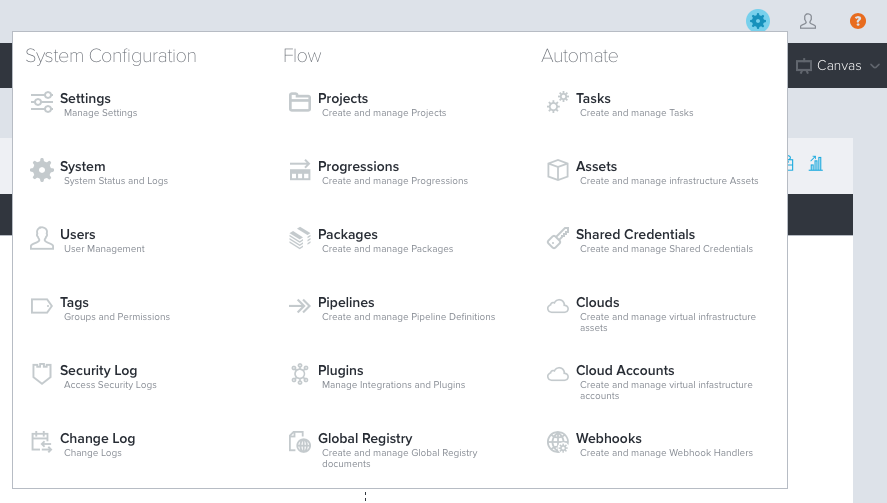

Plugins
=======

To begin, let’s configure Continuum so that it knows how to talk to TeamForge
and Jenkins. This is done via plugins and these are configured in the Admin
menu.  All of the “administrative” actions in Continuum are on the Admin menu.
This is a small gear in the top right of the title bar.  Click it and then
choose Plugins:

TeamForge Plugin
----------------
On the left-hand side, you will see all of the available plugins. To begin,
choose the TeamForge plugin from the list. Then click Add to add our TeamForge
instance.  There are only a few values to provide:

* **Name**: An alias or name to use to refer to this instance. This becomes
  significant if you add multiple TeamForge servers as this is how you will
  distinguish which one you are working with later on.
* **User/Password**: The credentials Continuum will use when talking to 
  TeamForge. This user needs to have the necessary RBAC permissions within
  TeamForge to retrieve information about work items, as well as execute any
  actions you specify in pipelines. Either specify a user that has Site Admin
  privileges in TeamForge, or make sure that this user is added to all of the
  necessary projects you are going to work with and the user is granted the
  necessary permissions required to do what you need it to do. You might want
  to have your site admin add this user to the list of users whose passwords
  do not expire.
* **URL**: The URL of the TeamForge server.  This should just be the base URL
  such as `https://teamforge.example.com/`

Be sure to try the Test Connection button before finishing.

Jenkins Plugin
--------------
Next, let’s add our Jenkins server. On the left-hand side choose Jenkins and
then click Add. The list of values to provide are the same as they are for
TeamForge. Note that Continuum has to be able to talk to your Jenkins server if
you want Continuum to be able to trigger jobs or retrieve information about
build jobs from Jenkins.

* **Name**: An alias or name to use to refer to this instance. It is very
  common to have many Jenkins servers, so this will become important when you
  are writing your pipeline activities later.
* **User/Password**: The credentials Continuum will use when talking to Jenkins.
  If your Jenkins server does not require any authentication to read jobs or
  trigger jobs then you can skip this.
* **URL**: The URL of the Jenkins server.  This should just be the base URL such
  as `https://jenkins.example.com/`

Be sure to try the Test Connection button before finishing.

**NOTE**: If you need to specify credentials then you will need to turn off CSRF
protection on your Jenkins server, otherwise the flow of HTTP requests that
Continuum makes to the Jenkins server may be blocked by the CSRF protections in
Jenkins.  This can be done from the Jenkins UI via
`Manage Jenkins > Configure Global Security`.  In the CSRF Protection section
uncheck the box that says: `Prevent Cross Site Request Forgery exploits`.

Links
-----

* Next Topic: [Pipelines](PIPELINES.md "Pipelines")
* Return to: [Overview](../README.md "Overview")

