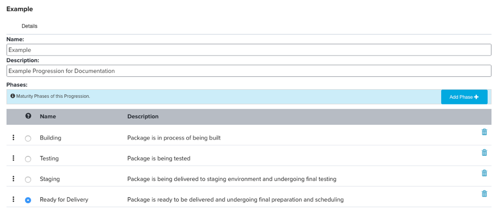

Progressions
============

A progression is where you define the phases of your value stream to track the
process your software goes through as it progresses in maturity from the initial
build until delivery.  In terms of figuring out what the phases should be in
your progression, I find it helps to start at the end, which is delivery. This
phase does NOT appear in your progression.  This is what your software
deliverable ultimately progresses too as its final step and when the specific
version you are tracking is removed from the progression board. Imagine starting
with a specific delivered version of your software.  From there, work backwards
and think though all of the activities that happened on that specific build, all
the way back to the build process.  Was it tested? Was it staged? Was it
scanned? Do you always do these steps before delivery?  Do you do them in a
specific sequence?  The answers to these questions, are a good start to defining
the phases in your progression.  Here are some good guidelines to follow though:

1.	Phases should be serial in nature.  If your stages are A > B > C then there 
    is an implication you never do C until after B has completed successfully 
    which does not happen until after A has completed successfully.  You
    probably have lots of activities that are done in parallel, such as
    regression testing and functional testing. It is common when there is a new
    build of software for someone to test out the new changes while automated
    tests are looking for regressions.  In this scenario, it would be best to
    combine these activities as two steps in the same phase rather than have two
    distinct phases.  If, however, you only do your functional testing after
    regression testing has successfully passed, then that is two stages.

2.	Phases should not be skipped. Imagine you are doing agile development where
    you deliver at the end of a 2-week iteration. Throughout the iteration lots
    of builds are being created and probably going through testing phases.
    Imagine you have things you do like security scans and performance tests.
    You probably do not wait for the final build to do these activities, because
    if they found a problem you would not be able to deliver anything.  The
    question, then, is whether these sorts of activities are phases, or are they
    part of another phase, like a testing phase.  The answer to this question
    should be whether that final build you deploy went through these activities
    or did they only happen on one of the earlier builds?  If the answer is that
    these activities were only done on an earlier build, then it makes sense
    that those activities be grouped into a general “Testing” phase and not be
    their own phase in your progression.  If however, the final build does have
    these activities performed then these should be their own phase in the
    progression, and it would be perfectly fine and normal for earlier builds
    in the iteration to also have progressed to those phases even though they
    were not delivered.  Finally, if you find yourself really believing these
    activities should show up as their own phases, but you do not currently run
    those activities on your final build, perhaps you should reconsider your
    process so that you are doing those activities on that final build.

3.	If you have multiple applications that all follow the same progression,
    you can have them all share a single progression board. It really just
    depends on whether you want to see them all on a single board or multiple.
    Likewise, if you have two components that are related to each other but
    they follow a different progression, you probably need to create two
    progressions and manage them on different boards.

Create Your First Progression
-----------------------------
With these guidelines in mind, let’s create our first progression. On the
Admin menu click on Progressions. On the list of Progressions, click the Add New
button to create a new progression. A dialog will pop-up where you can give it
a name and description.  Other than figuring out what your phases should be,
creating them and ordering them is actually pretty easy and self-explanatory.

A couple of things to note:

1.	The radio button exists for you to select the phase at which you consider
    a work item to be “code-complete”. This is used to track the time it takes 
    a work item to reach code-complete and provide reporting around risk and 
    quality.
    
2.	You cannot rename a phase, but you can delete a phase and then add a new
    phase with the new name and put it in the same spot in the order.  The only
    thing to be aware of is you do not want to delete a phase while there are
    any packages currently in that phase as this will remove the packages from
    your progression board.

That is all you do for a Progression.  The details of what these phases mean
and what activities are done, happens in the next topic on packages.

Links
-----

* Next Topic: [Packages](PACKAGES.md "Packages")
* Previous Topic: [Pipelines](PIPELINES.md "Pipelines")
* Return to: [Overview](../README.md "Overview")

