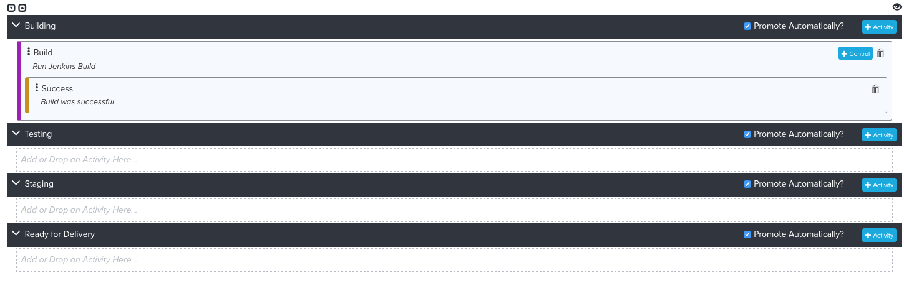
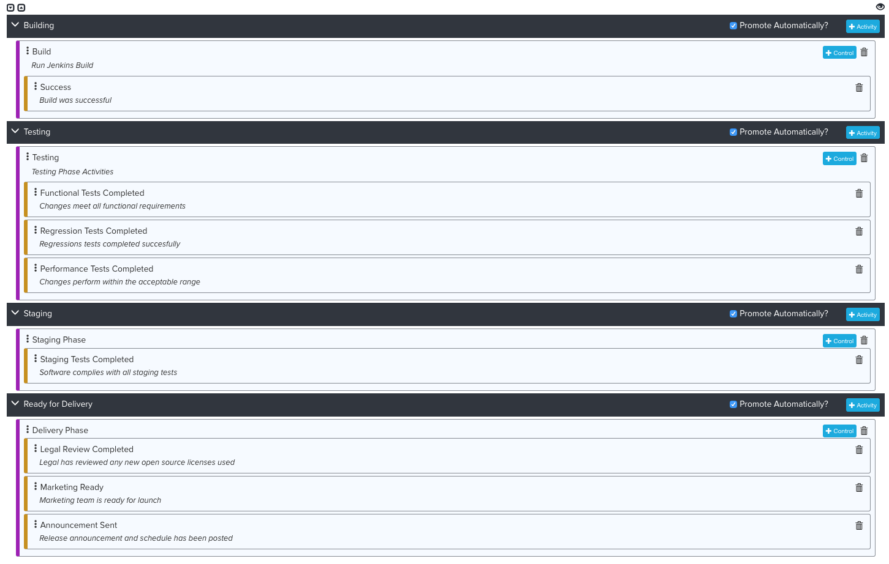
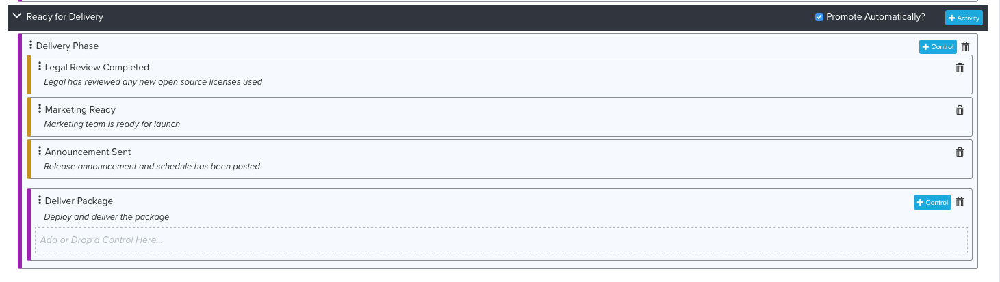

Configure Package
=================

On the Admin menu click on Packages so we can go back and finish setting up our
package.  If you recall, we created the package and chose the Progression it
followed but we stopped before adding any Activities.  This is because the
Activities will need to reference the Project and we had not created that yet.
Now that everything has been created we can setup the Activities we want to do
in each phase of the progression.  Starting with the “Building” phase click on
the Add Activity button.  That will pop-up a dialog which will look like this
once filled in:

The Activity Name and Description are just for documentation to identify the
activity in the UI.  The Type will be Initiate Pipeline by default and that is
what we want to do.  Type in the name of the Pipeline we created and also the
Project name.  The group is not needed here and will come from the package.
In our example, we might have commits and packages for both our master branch
but also release branches.  Those will appear as separate package in the
progression.

Click Save.  Next we want to add a Control to this activity.  This is what will
determine that it is ready to promote.  If you remember when we created our
pipeline we had it set a pass/fail value on a control named “Success”.  This is
where we want to add that control.  After you add the control it should look
like this:

Now we are going to add controls for the remaining stages.  If we had built
automation pipelines for each of these stages we would just follow the same
procedure.  Instead, we are going to insert Manual Activities and controls.
This is a nice feature of Continuum as not many companies have an entirely
automated process.  Perhaps you need some kind of legal approval or you need to
wait for Marketing to change something on the website before you deliver etc.
Continuum lets you define these manual activities and even assign them to
specific users so you can track and capture these signoffs.  This also allows
you to get metrics in your value stream to identify where your bottle necks are.
Some bottle necks can never be removed but once you have identified them and can
measure them, it at least brings visibility so you can plan for them.

In our case, we are just going to use manual controls as a simple way to
simulate the rest of the process.  On the Testing Phase click Add Activity.
On the resulting dialog you are going to change the type to Manual Activity:

The category and estimated touch time drive some of the metrics.  Refer to the
documentation for details.  As you can see you can assign this activity to
specific individuals.  This will cause them to receive an email when the package
is ready for them to respond.  You then just type a Title and Text that will
show up on a dialog where you confirm the activity is complete.  This dialog
has a text entry field where the user could type in something like test results
and you can require that something be entered.  Click Save.

You can also add controls to the manual activities.  These will appear as check
boxes on the dialog.  So in this example, we could add controls that say
“Functional Tests Completed”, “Regression Tests Completed” and “Performance
Tests Completed” and those would appear as check boxes on the dialog to confirm
all steps have been completed.  These boxes could even be checked one at a time
over the course of several days.

Go ahead and add Manual Activities and Controls for the remaining phases of the
progression.  You should end up with something like this:

Now there is one more step to do.  In the final phase, after the manual
controls are run we want to run the Delivery pipeline we created earlier.
This marks the package as Delivered which will also remove it from the
Progression.  To do that we need to add a second activity to the Ready for
Delivery phase.  Click on Add Activity.

Give it a name and description and then specify the name of the pipeline we
created earlier and also specify our project name and click Save.  The activity
will be inserted after the manual activity.  We do not want to leave it like
this.  If we did then when the package reached this phase it would run both
activities at the same time in parallel.  We only want to run this activity
after the manual activity is complete.  To do that just drag the second
activity and drop it inside the manual activity.  It should look like this
when you are done:

At this point we are done and ready to start testing our configuration by
making some commits to our sample application.

###Links

Next Topic: [Testing](TESTING.md "Testing")

Previous Topic: [Projects](PROJECTS.md "Packages")

Return to: [Overview](../README.md "Overview")

