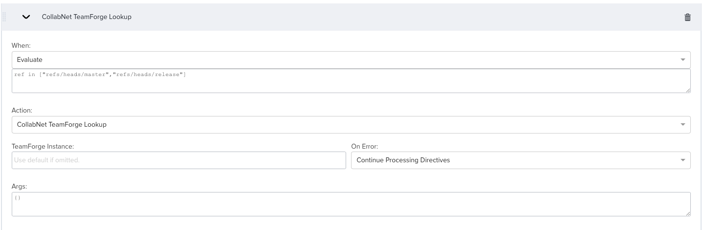
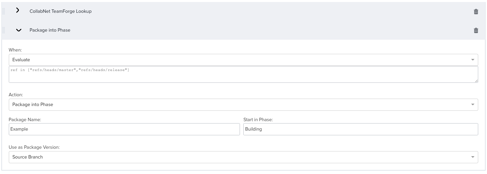
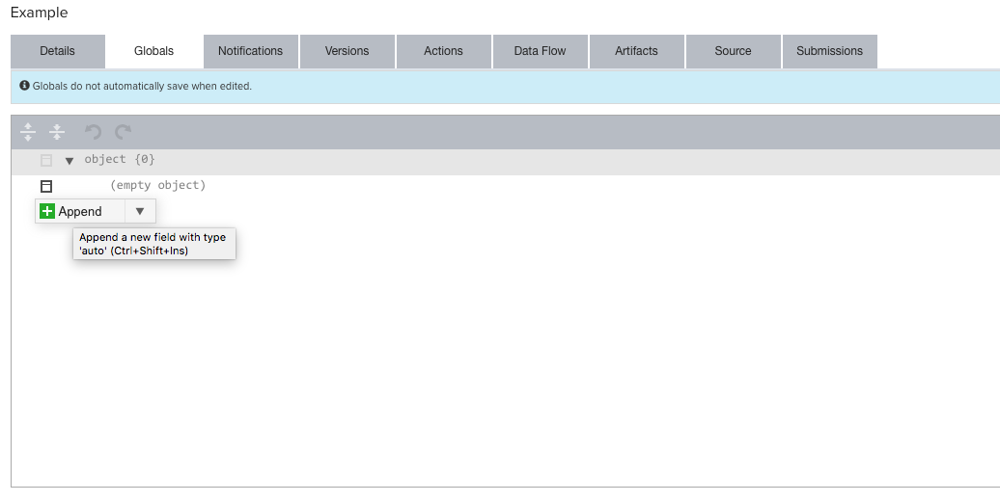

Projects
========

This is where you connect Continuum with your source code and work items.
Normally, this is probably the place you would begin learning about Continuum
but as you will see to fully configure the project we are going to have to
reference the objects we have created previously which is why I have delayed
talking about Projects until now.

There are a few types of projects but the primary type is a “Source” project
which means it is connected with a source code repository.  Connected in the
sense that the project will be setup to receive incoming webhooks from a source
code repository as commits occur.  The webhook payload contains information
about the commit that Continuum will use to start tracking the changes you
are making and initiate your pipelines.  One of the things we will do is have
Continuum identify the work items that were referenced by these commits.
This is the backbone of the entire system, that linkage between commits and
work items and then the build and packages they produce and are progressed
through your value stream.

Create Your First Project
-------------------------
On the Admin menu choose Projects then click Add New. A wizard pops up, but
it does not support TeamForge yet so you need to take the Manual option and
then click Next.  Provide a Name and Description for your project and click Ok.
You cannot change the name after the fact.

On the Details tab of the project, click on Type and choose Source from the
drop-down.  Then click on the Source Tab.  In the Changes From drop down choose
TeamForge Git Webhook.  This will populate the webhook URL that you are going
to copy into TeamForge.  Click on the Copy icon to copy the URL to your
clipboard.

Configure TeamForge Webhook
---------------------------
Switch over to TeamForge and view your Git repository and click on its Settings
tab.  Then click on the Policies tab.  At the bottom of the page is a place to
enter webhooks.  Paste the URL into the box.  The URL contains the string
<API Token>.  You need to replace this with your API token from Continuum.
To get that value go back to Continuum and in the top right corner click
on the Profile icon and then choose Account Details. This will pop open a
dialog where you will see your API token. There is a copy icon to copy the
token to your clipboard.  Do that and then switch back to the TeamForge
window and paste it in place of the <API Token> string in the URL.  Make
sure the Event type is “ref-updated” and click the Add button.  Then
be sure to click the Save button so that the hook information is
actually saved to the server.  That is all you have to do in TeamForge.  All
new commit activity will start flowing to Continuum as soon as you save this
value.  There is more configuration we need to do in Continuum so that it knows
how to handle this incoming data.

Configure Continuum Project
---------------------------
Back in Continuum there is more to do on the Source tab.  First. we need to
configure the Group.  Repositories often have a lot of different activity
going on, such as commits for different releases or feature branches etc.
As these commits flow into Continuum we want to group these submissions in a
logical way. Typically, they are grouped by the Git branch that is related to
the change and you can just leave the default setting.  There is currently a
bug in Continuum where it is storing a Branch value of null for incoming
TeamForge activity so we want to use the other option which is
“Lookup in Submission”.  We will calculate the branch name ourselves based on
the refname which is available in the submission.  Enter this value:

    [$ ref.replace('refs/heads/', '') $] 

This basically just strips refs/heads/ from the refname which is the same thing
Continuum would normally be doing to calculate the branch name.  So once the
bug is fixed you could switch to just using the Branch option or just leave
this value which will always work.

Next we want to add Directives.  These tell Continuum what to do with the
submissions it receives.  We are currently going to add two directives.  The
first one will process the incoming commits to identify TeamForge work items
referenced in the commits.  The second one will create a package and add it
to the Build phase of our progression.  You could also add directives to
initiate a pipeline but we are instead going to allow the configuration of our
package in the progression to do this for us.

Click the Add button.  When you first click the Add button it adds the
Initiate Pipeline directive to your project.  You then have to click on it to
expand it and you can change it to another directive by clicking on the Action
drop-down and choosing from the available list of options.  We want to select
the one named “CollabNet TeamForge Lookup”.  If your work items were coming
from VersionOne Lifecycle or Atlassian JIRA you would choose that option
instead.  If your commits happen to use multiple work item systems you can add
directives for each of them so that all of the correct work items are
identified.  There are some additional changes to make to the form:

In the When drop down change it from Always to Evaluate.  Here we want to limit
the directive to specific values in the incoming submission.  All git activity
is going to be sent to Continuum, we only care about changes to our master
branch or any of our release branches.  Other activity such as creation of
tags, or commits to developer feature branches can be ignored.  If you wanted
to do something for those commits you of course could but I do not.  Enter
this evaluate condition:

    ref in ["refs/heads/master","refs/heads/release"]

This directive will only run when the change is for master or one of my release
branches.  Of course in this example it assumes I have a naming standard of
“release/1.x” for my release branches.

Now let’s add another directive.  Click Add again and then expand it and change
the Action to “Package into Phase”.  What this directive is going to do is
create a package for us, and add it to our progression in the phase we specify.
When we are done we are going to go back and finish setting up our package and
one of the things we will do is configure the package to run our build pipeline
in this phase.  Your screen should look like this:

I added the same Evaluate condition so that this directive only is processed
for commits to master or a release branch.  I then had to type in the name of
the package I want to create and the phase in my progression I want it to set
the package to.  That is it.

Before we go back and configure our package there are two more things to do in
the Project configuration.

Configure Project Artifacts
---------------------------
Click on the Artifacts tab and click on Add New.  We are going to configure
the name of the artifact that we will be creating in our build pipeline.  I am
just going to specify a value of “webapp”.

Configure Project Globals
-------------------------
If you recall when we setup our pipeline we referenced several global variables
from the project so that we could use this same pipeline for multiple projects.
Now is when we will configure those variables.  Click on the Globals tab and
then click on the icon next to “Empty Object” and choose Append:

This will insert an entry into the list where you can type a key and a value.
These are the keys to enter - change the values to your Jenkins build job name,
server name, version number etc.

    buildJobName     JenkinsBuild
    buildJobServer   Jenkins
    artifactName     webapp
    version          1.0

Continuum auto-detects the type of data you enter.  For the version it will
want to treat it as a number but we want it to be a String so that the value is
“1.0” and not “1”.  If you click on the icon next to the key name a menu
pops-up and you can click on Type and change it from Auto to String.

We are almost done.  If you recall in the previous topic on Packages we had to
defer setting up the package.  Now that we have created our project we can go
back and finish the configuration.

###Links

Next Topic: [Configure Package](PROJECT-PACKAGE.md "Configure Package")

Previous Topic: [Progressions](PACKAGES.md "Packages")

Return to: [Overview](../README.md "Overview")

