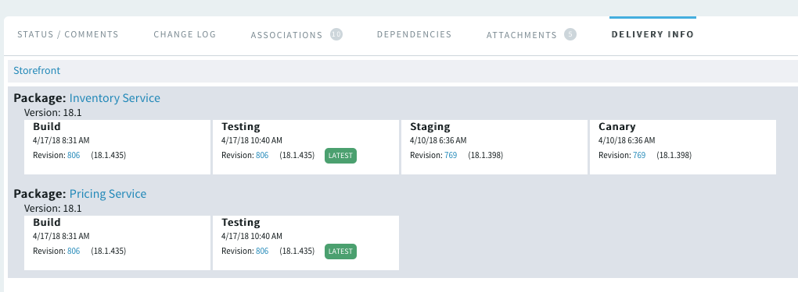

TeamForge Delivery Information
==============================

Once you have configured Continuum to manage your DevOps process you can also
configure TeamForge so that it can display the delivery information from
Continuum inside TeamForge in context.  In other words, when you are viewing
an artifact (work item) or commit in the TeamForge UI you can see the delivery
information from Continuum.

Configuration
-------------
There is some one-time configuration to do to turn on this feature. You must be
logged in to TeamForge as a Site Administrator.  You can then go to 
`Admin > System Tools > Configure Application` and click on the Delivery section:

You then just need to enter the URL to your Continuum server along with an API
token for a user with permission to retrieve information from this server.  This
is used by the TeamForge server to retrieve information from Continuum, so the
TeamForge application server must be capable of communicating with the Continuum
server.  This is only used internally by TeamForge, so this API token is never
exposed to any TeamForge users.  In addition, TeamForge still applies its own
RBAC rules so that a user cannot see delivery information for any TeamForge object
they are not allowed to view.

Once this feature is enabled it add a new Delivery Info section in the TeamForge
UI when viewing commits or artifacts.

Viewing Commit
--------------
When viewing any Git or SVN commit in TeamForge a new Delivery Info section will
be added to the page.  If the commit is part of a repository that is configured
to use Continuum then it will display the delivery information from Continuum.

In this example, you can see that this commit has progressed as far as the
Testing phase. So perhaps a bug report has come in and you thought it had
already been fixed. You find the commit you were thinking of and by viewing the
Delivery Information you can see that the issue is that the fix you were
thinking of is still being tested and has not been delivered yet.

Viewing Artifact
----------------
Likewise, when you view a TeamForge artifact a new Deliver Info tab has been
added that will show the delivery information for the artifact.  The information
for an artifact can often be more complicated because there may have been many
commits for many repositories targeting many packages that are all being performed
on behalf of this artifact.  Here is a simple example:

Here we can see that changes have been made to two packages for this artifact.
In addition, the **LATEST** tag makes it clear that some changes were made for this
artifact and made it all the way to the Canary deployment stage, but then more
work was done and those changes have only progressed as far as the Testing stage.

Perhaps the artifact itself has been marked Done because the work is done, but
by being able to see the actual Delivery information you can see that the changes
for this artifact have not actually been delivered yet.

Links
-----

* Return to: [Overview](../README.md "Overview")

