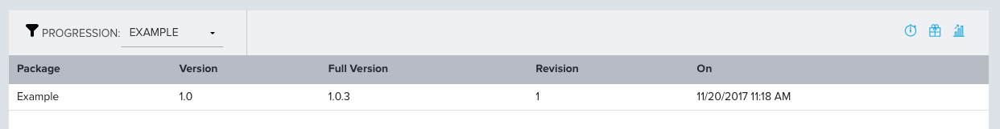

Testing Our Value Stream
========================

Assuming you have gone through all of the previous pages and set everything up
let's run through a test so we can see it all working.

Make a Source Code Change
-------------------------
Clone your git repository, make a change to a file and commit it. Be sure to
reference a TeamForge artifact in the commit message as that is one of the
things we will be wanting to verify.

Push your change to the server (presumably to the master branch).  That should
be all that is needed to initiate the process in Continuum.

Observe Change in Continuum
---------------------------
Switch to the Continuum web interface and click on the Progression tab in the
menu. If necessary, choose your Progression in the drop-down box. You should see
something like this:

If everything is working, you should see your package in the Building column, or
perhaps the next column if the build has already completed.

**Troubleshooting**  
If you do not see a package then something went wrong with the submission. Go
to the Admin menu and select Projects and then click on your Project and the
Submission tab on the far right. This will list all of the submissions. You
should see your commit in the list:

***You do not see your commit***  
If you do not see your commit then you probably did not setup the webhook
correctly in TeamForge. Switch back to your TeamForge repository settings and
verify the webhook exists in the configuration.  It is easy to add the webhook
and then forget to save it.  If you see the webhook then verify the URL matches
the value you see in the Continuum project AND verify that you replaced the
api-token with a valid token from your Continuum profile.

If everything looks right, the one other thing to check would be that in the
Continuum project on the Source code tab you have the right value in the
"Changes From" drop down. I made a mistake one time where I selected 
"TFS Git Webhook" instead of "TeamForge Git Webhook". Since this value tells
Continuum what to expect in the payload it is important that this be set right.

***You do see your commit***  
If you do see your commit then click on it to view it. There are two tabs that
can be useful. The first one is the Logfile. This will show what Continuum did
when it handled the Submission. If you have any problems in your Directives
they will show up here in the log.

The other interesting thing to look at in the Submission is the "Raw Payload".
This lets you see the JSON payload from the incoming webhook.

Observe Build Pipeline in Continuum
-----------------------------------
Hopefully everything just worked and you were able to skip over the
Troubleshooting information. Let's move on to how you can observe your build
pipeline which should be running or perhaps has already finished.  In the menu
click on Pipelines and then Instances. You should see an entry in the list for
your running pipeline:

Click on it to view details.  This is what it will look like if the pipeline
is still running:

And this is what it will look like after it finishes (hopefully):

Note that Continuum pulls in the information from the Jenkins job including its
status and the test information from Jenkins.

**Troubleshooting**  
Viewing the pipeline instance will generally have the information you need to
troubleshoot problems. For example, the log is generally the best place to
start:

If there were errors communicating with Jenkins they will appear in this log
as would other errors in the pipeline configuration. If Continuum was able
to communicate with Jenkins then it will have pulled back the log from Jenkins
and you can view it here. This can be useful if your problem was a failure in
the Jenkins job, as you will be able to see the information here.

In addition to the log, you can also view the Workspace and the JSON data it
contains. This is probably more useful in terms of understanding what data is
available to reference in your pipeline for future changes you might want to
make.

Perform Manual Activities
-------------------------
Again, hopefully everything is working smoothly and you have been able to skip
over the troubleshooting sections.  Assuming your pipeline and Jenkins build
were all succesful your Progression will now look like this:

If you recall when we configured our Package we set it up to automatically
promote if the Build was succesful.  So our Package has moved to the Testing
phase. Also note that the version number of the Package was changed to match
the value we configured which was a combination of a version number we entered
in our Project Globals and the build number.

If you configured your package to assign this step to a specific user(s) they
will have received an email notification and the link would take them to a
screen where they can manually confirm the action is completed. We can get to
that same screen by clicking on the Package revision number in the bottom right
corner of the Package card.  That will take you to a screen that looks like
this:

This screen lets you view the details of where a package is in the progression
model. This shows it is currently in the Testing Phase.  If you click on that
phase it will bring up the Manual activity confirmation dialog:

A tester could come to this screen and click the Start Working on This button
to signal that they are the one doing the testing, so that someone else does
not bother to "take" this activity. Other than that, the controls that we
entered show on this dialog. A user can click the check mark if they have
completed the task, or the X if the control failed.  There is also a Mark as
Failed button to indicate the failure. This would generally mean that this
revision of the package has failed and is not going to go any farther in the
progression. Presumably a new commit will happen that fixes the problem and
this will trigger a new build that creates a new version of the package.

Assuming all the tests pass and the user clicks the check on all of the controls
the dialog will look like this:

The Mark as Complete button is now enabled and can be clicked. The way we have
configured our Progression it means the package will be promoted to the next
phase:

Delivery
--------
At this point the process just repeats as the package completes each phase of
the progression. Go ahead and see it all the way through so that you can
confirm the final phase works. Once the package is "Delivered" it will be
removed from the board. If you click on the "package" icon on the top-right of
the Progression board you can see the list of delivered packages:

Links
-----

* Return to: [Overview](../README.md "Overview")
